# Veltro

# NEW SDD SPECIFICATION — VELTRO

## SECTION 1 — FUNCTIONAL VISION AND SCOPE

**Product:** Veltro

**Type:** Lightweight ERP/POS system for small and medium commercial businesses.

### Problem Statement

Commercial SMEs operate with manual processes that generate three critical problems:

- **Silent stock-outs:** No early warning before a product runs out of stock.
- **Zero traceability:** No auditable record of who sold what, when, or at what price.
- **Slow sales process:** Manual product registration slows down the point of sale.

### Value Proposition (What and Why)

Veltro solves these three problems with a secure transactional flow based on web barcode scanning (executed on the client), automatic stock deduction via domain events, and an immutable audit trail in the database.

### Functional Scope — What the system DOES (IN SCOPE)

- **RF-01:** User authentication with JWT (login, refresh, logout, password change).
- **RF-02:** Product catalog management with hierarchical categories and soft delete.
- **RF-03:** Barcode scanning from the browser camera (`react-zxing` on frontend). The backend does NOT process video frames.
- **RF-04:** Point of Sale (POS): create cart, add items, confirm sale, void sale.
- **RF-05:** Automatic stock deduction upon sale confirmation (via domain event `SaleCompletedEvent`).
- **RF-06:** Inventory management: manual entries, shrinkage exits, physical count adjustments.
- **RF-07:** Purchase orders to suppliers with lifecycle (Pending → Partial → Received) and cloning function.
- **RF-08:** Proactive stock alert system (Out of Stock, Low Stock, Overstock) with configurable thresholds per product.
- **RF-09:** Dashboard with today's sales KPIs, out-of-stock products, and estimated monthly profit.
- **RF-10:** Report export in PDF and Excel.
- **RF-11:** AI Vision as fallback when a product has no barcode (Strategy Pattern: `ZXing` → `OpenAI`).
- **RF-12:** Role-based access control (ADMIN, CASHIER, WAREHOUSE) on every endpoint.

### Explicit Exclusions — What the system does NOT do (OUT OF SCOPE)

- Does not manage external payment gateways (Stripe, MercadoPago) in this version.
- Does not include electronic invoicing or SUNAT/SAT integration.
- Does not manage multiple branches or node synchronization.
- Does not include HR or payroll modules.

### System Roles

- **ADMIN:** Full access. User management, sale voiding, reports and audit.
- **WAREHOUSE:** Product and supplier CRUD, purchase orders, inventory movements.
- **CASHIER:** Scan products, register sales, check stock, view own sales.

---

## SECTION 2 — ARCHITECTURE DECISION RECORDS (ADRs)

Each ADR documents a firm architectural decision. They are **NON-NEGOTIABLE** for programming agents. An ADR decision cannot be reverted without explicit approval from the Architect.

### ADR-001 | `react-zxing` runs on the FRONTEND (not on the backend)

- **Status:** APPROVED
- **Context:** The previous design sent video frames to the backend via `multipart/form-data` to process barcodes with ZXing.
- **Decision:** The `react-zxing` library is integrated directly into the `ScannerContainer` component on the frontend. The barcode is decoded in the client's browser. The backend ONLY receives the already-decoded code string via `GET /api/v1/products/barcode/{barcode}`.
- **Consequence:** The `POST /api/v1/scanner` endpoint is eliminated. The backend no longer depends on ZXing in its classpath for the main sales flow.
- **Justification:** Eliminates image buffer processing on the server, drastically reducing pressure on the backend Garbage Collector.

### ADR-002 | `@Version` mandatory on all POS entities

- **Status:** APPROVED
- **Context:** In a concurrent sales environment, two cashiers may attempt to modify the same `SaleEntity` or `InventoryEntity` simultaneously.
- **Decision:** EVERY entity participating in the POS flow (`SaleEntity`, `SaleDetailEntity`, `InventoryEntity`) must declare the field: `@Version private Long version;`
- **Consequence:** The service that confirms a sale MUST catch `OptimisticLockException` and rethrow it as a domain exception with a user-readable message (e.g.: *"The cart was modified by another user, please reload."*).
- **Justification:** Prevents silent race conditions (*lost updates*) in sales. Without this, stock can go negative or one sale can overwrite another.

### ADR-003 | Event ordering delegated to PostgreSQL. PriorityQueue and in-memory frame Queue are eliminated.

- **Status:** APPROVED
- **Context:** The previous specification used `PriorityQueue` to sort alerts and `Queue<Frame>` to enqueue video frames in memory.
- **Decision:** In-memory queues are eliminated. Alert processing order is determined by `ORDER BY severity DESC, createdAt ASC` in the PostgreSQL query. Video frames no longer reach the backend (see ADR-001).
- **Consequence:** A composite index must be added on the alerts table over `(severity, created_at)` in the corresponding Flyway migration.
- **Justification:** In-memory queues do not survive server restarts, do not scale horizontally, and generate unnecessary GC pressure.

### ADR-004 | Immutable audit fields with `updatable=false` and `nullable=false`

- **Status:** APPROVED
- **Context:** The `AbstractAuditableEntity` class existed but without strict constraints on its creation fields.
- **Decision:** The `createdAt` and `createdBy` fields are annotated with `@Column(updatable = false, nullable = false)`. The `AuditorAware` bean is mandatorily configured to read the user from the `SecurityContextHolder`.
- **Consequence:** If the security context is not available at persist time (e.g. in scheduled jobs), a default system user ('SYSTEM') must be used.
- **Justification:** Guarantees audit trail integrity. An audit record without an author or with a modifiable date has no legal or operational value.

### ADR-005 | `precision=19, scale=4` on ALL monetary fields

- **Status:** APPROVED
- **Decision:** Every `BigDecimal` field representing money is annotated with `@Column(precision = 19, scale = 4)`. This applies to: `costPrice`, `salePrice`, `unitPrice` (snapshot in sale detail), `subtotal`, `total`, `unitCost` in `PurchaseOrderEntity`.
- **Consequence:** Flyway migrations must declare these columns as `NUMERIC(19,4)`. Response DTOs must expose these values as `String` or `Number` with 4 decimal places to avoid precision loss in JSON serialization.
- **Justification:** `double` and `float` types are inappropriate for money due to IEEE 754 representation errors. `scale=4` allows cent subdivisions needed in VAT and profitability calculations.

### ADR-006 | State Pattern for PurchaseOrderEntity and SaleEntity lifecycle (not Enum with switch)

- **Status:** APPROVED
- **Context:** An Enum with switch/if blocks to manage state transitions violates the Open/Closed principle and is a known anti-pattern.
- **Decision:** The lifecycle of `PurchaseOrderEntity` (Pending, Partial, Received, Voided) and `SaleEntity` (InProgress, Completed, Voided) is implemented with the State Pattern. Each state is a class that implements the `SaleState` or `OrderState` interface with methods like `confirm()`, `void()`, `receivePartial()`.
- **Consequence:** Adding a new state does not require modifying existing code, only creating a new class that implements the state interface. Invalid transitions throw a domain exception `InvalidStateTransitionException`.
- **Justification:** Extends the system without regression risk. The State Pattern is the canonical solution for state machines in DDD.

---

## SECTION 3 — PROGRAMMING AGENTS CONTRACT

This contract defines exactly WHAT each agent must build and under WHAT criteria their work is accepted. An agent CANNOT mark a task as complete if it does not meet the listed acceptance criteria.

### NON-NEGOTIABLE ACCEPTANCE CRITERIA (apply to the ENTIRE system)

- **AC-01 | MONETARY PRECISION:** No field representing money uses `double`, `float`,
or `int`. Only `BigDecimal` with `@Column(precision=19, scale=4)`.
*Verification:* review all entities and DTOs.
- **AC-02 | AUDIT:** Every sale record, inventory movement, and purchase order has
`createdAt`, `createdBy` (immutable) and `updatedAt`, `updatedBy`. The
`AuditorAware` bean is configured and active via `VeltroAuditorAware`.
*Verification:* insert a record and confirm that all 4 fields are filled
automatically.
- **AC-03 | CONCURRENCY CONTROL:** The entities `SaleEntity`, `SaleDetailEntity`
and `InventoryEntity` have the `@Version` field. *Verification:* an integration
test launches two concurrent transactions on the same sale; the second must fail
with `OptimisticLockException`.
- **AC-04 | NON-NEGATIVE STOCK:** The system MUST NEVER allow confirming a sale if
`currentStock - requestedQuantity < 0`. This validation occurs in the service
layer, NOT in the frontend, and throws `InsufficientStockException` mapped to
HTTP 422 with error code "INSUFFICIENT_STOCK".
*Verification:* attempt to sell 10 units of a product with stock 5; the response
must be HTTP 422 with a domain error message.
- **AC-05 | SOFT DELETE:** No record is physically deleted. The `active=false` field
deactivates the entity. Listings filter by `active=true` by default.
*Verification:* deactivate a product and confirm it does not appear in the public
listing, but does appear in the audit query.
- **AC-06 | DATA SECURITY:** The `passwordHash` field NEVER appears in any response
DTO or in any entity `toString()`. *Verification:* any user endpoint that returns
data does not include this field.
- **AC-07 | PAGINATION:** All listing endpoints return `Page<T>` (backend) and
`PageResponse<T>` (frontend). No endpoint returns an unpaginated `List<T>`.
*Verification:* call the product listing endpoint without parameters and confirm
the response includes `totalPages`, `totalElements`, `currentPage`.

### MAIN USE CASES

**UC-01 | Simple Sale with Scanner**

- **Actor:** CASHIER
- **Flow:** The cashier opens the POS. `react-zxing` activates the camera. The
cashier scans a product. The frontend decodes the barcode and calls
`GET /api/v1/products/barcode/{barcode}`. The product is added to the cart
(`cartStore` in Zustand). The cashier repeats for multiple products. Finally
calls `POST /api/v1/sales/{id}/confirm`.
- **Postcondition:** `SaleEntity` in COMPLETED status. Stock deducted via
`SaleCompletedEvent`. `AuditRecordEntity` created.
- **Acceptance criterion:** The complete flow takes less than 3 HTTP calls from
having the barcode until the sale is confirmed.

**UC-02 | Concurrent Sale (two cashiers, same product)**

- **Actor:** CASHIER A and CASHIER B simultaneously
- **Flow:** Both cashiers have the same product (stock=1) in their cart. Both
confirm the sale at the same time.
- **Postcondition:** Only one sale is confirmed. The other receives HTTP 409
Conflict with error code "CONCURRENCY_CONFLICT" and message
*"Stock was modified, please verify availability."*
- **Acceptance criterion:** Stock NEVER goes negative. Requires ADR-002
(`@Version`) implemented.

**UC-03 | Sale Voiding**

- **Actor:** ADMIN
- **Flow:** The ADMIN calls `POST /api/v1/sales/{id}/void`. The system verifies
the sale is in COMPLETED status (not VOIDED). Transitions the sale to VOIDED
status. Publishes `SaleVoidedEvent`. The listener reverts the stock (adds back
the quantities from the details).
- **Postcondition:** Stock reverted to its previous value. `SaleEntity` in VOIDED
status. `AuditRecordEntity` with `previousData` and `newData`.
- **Acceptance criterion:** Attempting to void an already VOIDED sale returns
HTTP 422 with `InvalidStateTransitionException`.

**UC-04 | Restocking via Purchase Order**

- **Actor:** WAREHOUSE
- **Flow:** The WAREHOUSE staff creates a `PurchaseOrderEntity` (PENDING status)
with products and quantities. When the merchandise arrives, calls
`POST /api/v1/purchase-orders/{id}/receive`. The system publishes
`OrderReceivedEvent`. The listener increments `currentStock` and records the
`MovementEntity` of type ENTRY.
- **Postcondition:** Stock incremented. Low stock alert resolves automatically if
the new stock exceeds the threshold.

**UC-05 | AI Fallback when product has no barcode**

- **Actor:** CASHIER
- **Flow:** `react-zxing` does not detect a barcode in 3 seconds. The frontend
activates AI mode: captures a frame and sends it to `POST /api/v1/scanner/ai`
(`multipart/form-data`). The backend delegates to the `AiVisionStrategy` of
OpenAI Vision API. The AI returns a list of `ProductSuggestionResponse` with
their confidence (%).
- **Postcondition:** The cashier selects the correct product from the list. This
is the ONLY endpoint where the backend receives an image (only for AI fallback,
not for the main flow).

---

## SECTION 4 — DETAILED TECHNICAL ROADMAP

**Advancement rule:** A task cannot be started if its predecessor is not marked as COMPLETED and its acceptance criteria verified. The Backend and Frontend columns run in parallel within each phase.

### PHASE 1 — FOUNDATIONS (Setup + IAM + Catalog)

**BACKEND**

- **B1-01 | Project setup:** Spring Boot 3.x, Java 21, PostgreSQL, Flyway. Hexagonal package structure. `AbstractAuditableEntity` class with ADR-004 applied (`updatable=false`, `nullable=false`). `AuditorAware` bean configured.
- **B1-02 | IAM Module:** `UserEntity`, JJWT (Access Token 15min + Refresh Token 7d), `AuthController` with `/login`, `/refresh`, `/logout`, `/change-password`. JWT filter in `SecurityFilterChain`.
- **B1-03 | Catalog Module:** `ProductEntity` + `CategoryEntity` (Composite Pattern, self-referencing FK). Flyway migrations with monetary fields `NUMERIC(19,4)` (ADR-005). `ProductController` with `GET /barcode/{barcode}` indexed (B-Tree on `barcode`).
- **B1-04 | Base Inventory Module:** `InventoryEntity` with `@Version` (ADR-002) and constraint `stock >= 0`. Endpoints for manual entry, exit, and adjustment.

**FRONTEND**

- **F1-01 | Project setup:** React 18 + TypeScript + Vite. Configure Axios with JWT interceptors (auto-attach token + silent refresh on 401). Zustand: `authStore` (token, user, role). Define types `ApiResponse<T>` and `PageResponse<T>`.
- **F1-02 | Authentication UI:** Login page with React Hook Form + Zod. `AuthGuard` and `RoleGuard`. Role-based redirect on successful login.
- **F1-03 | Catalog UI:** Product listing page with pagination (`PageResponse<ProductResponse>`). Create/edit product form. Category tree component.

### PHASE 2 — BUSINESS CORE (POS + Scanner + Automatic Inventory)

**BACKEND**

- **B2-01 | Sale Module (POS):** `SaleEntity` + `SaleDetailEntity` with `@Version` (ADR-002). State Pattern: `SaleState` interface, classes implementing each state. Negative stock validation (AC-04) in `SaleService`. `SaleController` with `/start`, `/add`, `/modify`, `/confirm`, `/void`.
- **B2-02 | Observer Pattern:** Publish `SaleCompletedEvent` on confirmation. Implement `DeductStockSaleListener` and `RegisterExitMovementListener`. Publish `SaleVoidedEvent` on voiding and implement stock reversal listener.
- **B2-03 | Proactive Alerts:** `AlertEntity` + `AlertConfigurationEntity`. Implement `EvaluateStockAlertsListener` (Chain of Responsibility: OutOfStock -> LowStock -> Overstock). Alert query with `ORDER BY severity DESC, created_at ASC` in PostgreSQL (ADR-003). Composite index in Flyway.
- **B2-04 | Purchasing Module:** `SupplierEntity`, `PurchaseOrderEntity` with State Pattern (ADR-006). `PurchaseOrderController` with `/create`, `/clone` (Prototype), `/receive`. `OrderReceivedEvent` listener that increments stock.

**FRONTEND**

- **F2-01 | Scanner + POS UI:** `ScannerContainer` integrating `react-zxing` (ADR-001). On decode, calls `GET /api/v1/products/barcode/{barcode}` and adds to `cartStore`. POS page with cart table, quantity modify buttons, and confirm sale button.
- **F2-02 | Alerts UI:** Unread alerts badge in the Header. Alert listing page ordered by severity. Component to configure thresholds per product.
- **F2-03 | Purchase Orders UI:** Create order form, listing page with visual states, clone order button, and merchandise reception flow.

### PHASE 3 — INTELLIGENCE AND REPORTS (AI + Dashboard + Export)

**BACKEND**

- **B3-01 | AI Fallback:** Implement Strategy Pattern: `ScannerStrategy` interface, implementations `BarcodeStrategy` (does nothing, frontend resolves) and `AiVisionStrategy` (calls OpenAI Vision API). Endpoint `POST /api/v1/scanner/ai` that receives `multipart/form-data` and returns list of `ProductSuggestionResponse` with confidence field.
- **B3-02 | Dashboard and Reports:** `DashboardController` with `GET /dashboard` (Facade Pattern: aggregates `todaySales`, `averageTicket`, `outOfStockProducts`, `estimatedMonthlyProfit`). `ReportController` with `GET /profitability` and `GET /export/{type}` (Factory Method: PDF via iText, Excel via Apache POI).
- **B3-03 | Forensic Audit:** `AuditRecordEntity` (append-only table, no soft-delete, no update). Command Pattern in `AuditService`: captures `previousData` (JSON) and `newData` (JSON) on each critical operation. Endpoint `GET /audit` for ADMIN only.

**FRONTEND**

- **F3-01 | AI Fallback UI:** 3s timer in `ScannerContainer`. If it expires without detection, show *"Identify with AI"* button. On activation, capture frame, send to backend and show modal with `ProductSuggestionResponse` list and confidence percentage.
- **F3-02 | Dashboard UI:** Dashboard page with KPI cards (`todaySales`, `averageTicket`, `outOfStockProducts`, `estimatedMonthlyProfit`). Latest sales table. Export PDF and Excel buttons.
- **F3-03 | Audit UI (ADMIN only):** Paginated table of `AuditRecordEntity` with filters by entity, action, and date range. Detail view with diff of `previousData` vs `newData`.

### PHASE 2 — BUSINESS CORE (POS + Scanner + Automatic Inventory)

**BACKEND**

- **B2-01 | Sale Module (POS):** `SaleEntity` + `SaleDetailEntity` with `@Version`
(ADR-002). State Pattern: `SaleState` interface, classes `InProgressState`,
`CompletedState`, `VoidedState`. Negative stock validation (AC-04) in
`SaleService`. `SaleController` with `/start`, `/add`, `/modify`, `/confirm`,
`/void`.
- **B2-02 | Observer Pattern:** Publish `SaleCompletedEvent` on confirmation.
Implement `DeductStockSaleListener` and `RegisterExitMovementListener`. Publish
`SaleVoidedEvent` on voiding and implement stock reversal listener.
- **B2-03 | Proactive Alerts:** `AlertEntity` + `AlertConfigurationEntity`.
Implement `EvaluateStockAlertsListener` (Chain of Responsibility: OutOfStock ->
LowStock -> Overstock). Alert query with `ORDER BY severity DESC, created_at ASC`
in PostgreSQL (ADR-003). Composite index in Flyway.
- **B2-04 | Purchasing Module:** `SupplierEntity`, `PurchaseOrderEntity` with State
Pattern (ADR-006). `PurchaseOrderController` with `/create`, `/clone`
(Prototype), `/receive`. `OrderReceivedEvent` listener that increments stock.

**FRONTEND**

- **F2-01 | Scanner + POS UI:** `ScannerContainer` integrating `react-zxing`
(ADR-001). On decode, calls `GET /api/v1/products/barcode/{barcode}` and adds
to `cartStore`. POS page with cart table, quantity modify buttons, and confirm
sale button.
- **F2-02 | Alerts UI:** Unread alerts badge in the Header. Alert listing page
ordered by severity. Component to configure thresholds per product.
- **F2-03 | Purchase Orders UI:** Create order form, listing page with visual
states, clone order button, and merchandise reception flow.

### PHASE 3 — INTELLIGENCE AND REPORTS (AI + Dashboard + Export)

**BACKEND**

- **B3-01 | AI Fallback:** Implement Strategy Pattern: `ScannerStrategy` interface,
implementations `BarcodeStrategy` (does nothing, frontend resolves) and
`AiVisionStrategy` (calls OpenAI Vision API). Endpoint `POST /api/v1/scanner/ai`
that receives `multipart/form-data` and returns list of `ProductSuggestionResponse`
with confidence field.
- **B3-02 | Dashboard and Reports:** `DashboardController` with `GET /dashboard`
(Facade Pattern: aggregates `todaySales`, `averageTicket`, `outOfStockProducts`,
`estimatedMonthlyProfit`). `ReportController` with `GET /profitability` and
`GET /export/{type}` (Factory Method: PDF via iText, Excel via Apache POI).
- **B3-03 | Forensic Audit:** `AuditRecordEntity` (append-only table, no
soft-delete, no update). Command Pattern in `AuditService`: captures
`previousData` (JSON) and `newData` (JSON) on each critical operation. Endpoint
`GET /audit` for ADMIN only.

**FRONTEND**

- **F3-01 | AI Fallback UI:** 3s timer in `ScannerContainer`. If it expires without
detection, show *"Identify with AI"* button. On activation, capture frame, send
to backend and show modal with `ProductSuggestionResponse` list and confidence
percentage.
- **F3-02 | Dashboard UI:** Dashboard page with KPI cards (`todaySales`,
`averageTicket`, `outOfStockProducts`, `estimatedMonthlyProfit`). Latest sales
table. Export PDF and Excel buttons.
- **F3-03 | Audit UI (ADMIN only):** Paginated table of `AuditRecordEntity` with
filters by entity, action, and date range. Detail view with diff of `previousData`
vs `newData`.

---

**END OF SDD SPECIFICATION — VELTRO** | **Date:** March 2026 | **Architect:** AI Orchestrator

# Veltro — Practical Artifacts for Immediate Start

> Architect: AI Technical Lead | Date: March 2026 | Version: 1.0.0
> 

---

## 1. Entity-Relationship Diagram (ERD) — erDiagram Mermaid

```mermaid
erDiagram
    %% ─────────────────────────────────────────
    %% CATALOG
    %% ─────────────────────────────────────────
    CATEGORY {
        BIGSERIAL id PK
        VARCHAR name "NOT NULL"
        TEXT description
        BIGINT parent_category_id FK
        BOOLEAN active "NOT NULL DEFAULT TRUE"
        TIMESTAMP created_at "NOT NULL"
        VARCHAR created_by "NOT NULL"
        TIMESTAMP updated_at
        VARCHAR updated_by
    }
    PRODUCT {
        BIGSERIAL id PK
        VARCHAR name "NOT NULL"
        VARCHAR barcode UK
        VARCHAR sku
        TEXT description
        NUMERIC cost_price "NOT NULL"
        NUMERIC sale_price "NOT NULL"
        BIGINT category_id FK
        BOOLEAN active "NOT NULL DEFAULT TRUE"
        TIMESTAMP created_at "NOT NULL"
        VARCHAR created_by "NOT NULL"
        TIMESTAMP updated_at
        VARCHAR updated_by
    }

    %% ─────────────────────────────────────────
    %% INVENTORY
    %% ─────────────────────────────────────────
    INVENTORY {
        BIGSERIAL id PK
        BIGINT product_id FK "UNIQUE"
        INTEGER current_stock "NOT NULL CHECK >= 0"
        INTEGER min_stock "NOT NULL"
        INTEGER max_stock "NOT NULL"
        BIGINT version "NOT NULL (ADR-002)"
        BOOLEAN active "NOT NULL DEFAULT TRUE"
        TIMESTAMP created_at "NOT NULL (ADR-004)"
        VARCHAR created_by "NOT NULL (ADR-004)"
        TIMESTAMP updated_at
        VARCHAR updated_by
    }
    INVENTORY_MOVEMENT {
        BIGSERIAL id PK
        BIGINT inventory_id FK
        VARCHAR movement_type "NOT NULL (ENTRY/EXIT)"
        INTEGER quantity "NOT NULL"
        INTEGER previous_stock "NOT NULL"
        INTEGER new_stock "NOT NULL"
        TEXT reason
        TIMESTAMP created_at "NOT NULL"
        VARCHAR created_by "NOT NULL"
    }
    ALERT_CONFIGURATION {
        BIGSERIAL id PK
        BIGINT product_id FK "UNIQUE"
        INTEGER critical_stock "NOT NULL"
        INTEGER min_stock "NOT NULL"
        INTEGER overstock_threshold "NOT NULL"
        TIMESTAMP created_at "NOT NULL"
        VARCHAR created_by "NOT NULL"
        TIMESTAMP updated_at
        VARCHAR updated_by
    }
    ALERT {
        BIGSERIAL id PK
        BIGINT product_id FK
        VARCHAR type "NOT NULL"
        VARCHAR severity "NOT NULL (INDEX)"
        TEXT message "NOT NULL"
        BOOLEAN read "NOT NULL DEFAULT FALSE"
        BOOLEAN resolved "NOT NULL DEFAULT FALSE"
        TIMESTAMP created_at "NOT NULL"
        VARCHAR created_by "NOT NULL"
        TIMESTAMP updated_at
        VARCHAR updated_by
    }

    %% ─────────────────────────────────────────
    %% POS — SALES
    %% ─────────────────────────────────────────
    SALE {
        BIGSERIAL id PK
        VARCHAR sale_number UK "NOT NULL"
        VARCHAR status "NOT NULL"
        BIGINT cashier_id FK
        NUMERIC subtotal "NOT NULL (ADR-005)"
        NUMERIC total "NOT NULL (ADR-005)"
        BIGINT version "NOT NULL (ADR-002)"
        BOOLEAN active "NOT NULL DEFAULT TRUE"
        TIMESTAMP created_at "NOT NULL (ADR-004)"
        VARCHAR created_by "NOT NULL (ADR-004)"
        TIMESTAMP updated_at
        VARCHAR updated_by
    }
    SALE_DETAIL {
        BIGSERIAL id PK
        BIGINT sale_id FK
        BIGINT product_id FK
        INTEGER quantity "NOT NULL"
        NUMERIC unit_price "NOT NULL (ADR-005)"
        NUMERIC subtotal "NOT NULL (ADR-005)"
        BIGINT version "NOT NULL (ADR-002)"
        TIMESTAMP created_at "NOT NULL"
        VARCHAR created_by "NOT NULL"
        TIMESTAMP updated_at
        VARCHAR updated_by
    }

    %% ─────────────────────────────────────────
    %% PURCHASING
    %% ─────────────────────────────────────────
    SUPPLIER {
        BIGSERIAL id PK
        VARCHAR tax_id UK "NOT NULL"
        VARCHAR company_name "NOT NULL"
        VARCHAR email
        VARCHAR phone
        VARCHAR address
        BOOLEAN active "NOT NULL DEFAULT TRUE"
        TIMESTAMP created_at "NOT NULL"
        VARCHAR created_by "NOT NULL"
        TIMESTAMP updated_at
        VARCHAR updated_by
    }
    PURCHASE_ORDER {
        BIGSERIAL id PK
        VARCHAR order_number UK "NOT NULL"
        BIGINT supplier_id FK
        BIGINT requested_by FK
        VARCHAR status "NOT NULL"
        NUMERIC total "NOT NULL (ADR-005)"
        TEXT notes
        BOOLEAN active "NOT NULL DEFAULT TRUE"
        TIMESTAMP created_at "NOT NULL"
        VARCHAR created_by "NOT NULL"
        TIMESTAMP updated_at
        VARCHAR updated_by
    }
    PURCHASE_ORDER_DETAIL {
        BIGSERIAL id PK
        BIGINT purchase_order_id FK
        BIGINT product_id FK
        INTEGER requested_quantity "NOT NULL"
        INTEGER received_quantity "NOT NULL DEFAULT 0"
        NUMERIC unit_cost "NOT NULL (ADR-005)"
        TIMESTAMP created_at "NOT NULL"
        VARCHAR created_by "NOT NULL"
        TIMESTAMP updated_at
        VARCHAR updated_by
    }

    %% ─────────────────────────────────────────
    %% IAM
    %% ─────────────────────────────────────────
    USER {
        BIGSERIAL id PK
        VARCHAR username UK "NOT NULL"
        VARCHAR email UK "NOT NULL"
        TEXT password_hash "NOT NULL"
        VARCHAR role "NOT NULL"
        BOOLEAN active "NOT NULL DEFAULT TRUE"
        TIMESTAMP created_at "NOT NULL"
        VARCHAR created_by "NOT NULL"
        TIMESTAMP updated_at
        VARCHAR updated_by
    }

    %% ─────────────────────────────────────────
    %% FORENSIC AUDIT
    %% ─────────────────────────────────────────
    AUDIT_RECORD {
        BIGSERIAL id PK
        VARCHAR entity "NOT NULL"
        BIGINT entity_id "NOT NULL"
        VARCHAR action "NOT NULL"
        TEXT previous_data "JSON"
        TEXT new_data "JSON"
        VARCHAR username "NOT NULL"
        VARCHAR ip_address
        TIMESTAMP created_at "NOT NULL"
    }

    %% ─────────────────────────────────────────
    %% RELATIONSHIPS
    %% ─────────────────────────────────────────
    CATEGORY             ||--o{ CATEGORY              : "parent to subcategories"
    CATEGORY             ||--o{ PRODUCT               : "categorizes"
    PRODUCT              ||--|| INVENTORY             : "has stock"
    PRODUCT              ||--o{ INVENTORY_MOVEMENT    : "records movements"
    PRODUCT              ||--o| ALERT_CONFIGURATION   : "has thresholds"
    PRODUCT              ||--o{ ALERT                 : "generates alerts"
    PRODUCT              ||--o{ SALE_DETAIL           : "appears in"
    PRODUCT              ||--o{ PURCHASE_ORDER_DETAIL : "appears in"
    SALE                 ||--o{ SALE_DETAIL           : "contains"
    USER                 ||--o{ SALE                  : "registers"
    SUPPLIER             ||--o{ PURCHASE_ORDER        : "supplies"
    PURCHASE_ORDER       ||--o{ PURCHASE_ORDER_DETAIL : "details"
    USER                 ||--o{ PURCHASE_ORDER        : "requests"
```



## 2. Local Infrastructure — docker-compose.yml

**File:** `docker-compose.yml`

```yaml
# docker-compose.yml — Veltro Dev Environment
# Usage: docker compose up -d
# Requirement: Docker Desktop >= 4.x
version: "3.9"
services:
  # ─────────────────────────────────────────────────────────────
  # PostgreSQL 16 — Veltro main database
  # ─────────────────────────────────────────────────────────────
  postgres:
    image: postgres:16-alpine
    container_name: veltro_postgres
    restart: unless-stopped
    environment:
      POSTGRES_DB: veltro_db
      POSTGRES_USER: veltro_user
      POSTGRES_PASSWORD: veltro_secret_2026
      PGDATA: /var/lib/postgresql/data/pgdata
    ports:
      - "5432:5432"
    volumes:
      - postgres_data:/var/lib/postgresql/data
      # Optional initialization script (extensions, extra schemas)
      - ./infra/init-db.sql:/docker-entrypoint-initdb.d/01-init.sql:ro
    healthcheck:
      test: ["CMD-SHELL", "pg_isready -U veltro_user -d veltro_db"]
      interval: 10s
      timeout: 5s
      retries: 5
      start_period: 15s
    networks:
      - veltro_net
  # ─────────────────────────────────────────────────────────────
  # pgAdmin 4 — UI to inspect and debug the DB locally
  # Access: http://localhost:5050
  # Login:  admin@veltro.dev / veltro_admin
  # ─────────────────────────────────────────────────────────────
  pgadmin:
    image: dpage/pgadmin4:latest
    container_name: veltro_pgadmin
    restart: unless-stopped
    depends_on:
      postgres:
        condition: service_healthy
    environment:
      PGADMIN_DEFAULT_EMAIL: admin@veltro.dev
      PGADMIN_DEFAULT_PASSWORD: veltro_admin
      PGADMIN_CONFIG_SERVER_MODE: "False"
      PGADMIN_CONFIG_MASTER_PASSWORD_REQUIRED: "False"
    ports:
      - "5050:80"
    volumes:
      - pgadmin_data:/var/lib/pgadmin
      # Pre-configured connection to local server (avoids manual setup)
      - ./infra/pgadmin-servers.json:/pgadmin4/servers.json:ro
    networks:
      - veltro_net
# ─────────────────────────────────────────────────────────────
# Persistent volumes
# ─────────────────────────────────────────────────────────────
volumes:
  postgres_data:
    driver: local
  pgadmin_data:
    driver: local
# ─────────────────────────────────────────────────────────────
# Internal network
# ─────────────────────────────────────────────────────────────
networks:
  veltro_net:
    driver: bridge
```

**File:** `infra/pgadmin-servers.json`

```yaml
{
  "Servers": {
    "1": {
      "Name": "Veltro Local",
      "Group": "Servers",
      "Host": "postgres",
      "Port": 5432,
      "MaintenanceDB": "veltro_db",
      "Username": "veltro_user",
      "SSLMode": "prefer",
      "PassFile": "/pgadmin4/.pgpass"
    }
  }
}
```

**File:** `infra/init-db.sql`

```sql
-- Optional extensions for UUIDs and fuzzy search
CREATE EXTENSION IF NOT EXISTS "uuid-ossp";
CREATE EXTENSION IF NOT EXISTS "pg_trgm"; -- indexes for product name search
-- Ensure correct timezone
SET timezone = 'America/Lima';
```

**File:** `src/main/resources/application-local.yml` (Spring Boot)

```yaml
spring:
  datasource:
    url: jdbc:postgresql://localhost:5432/veltro_db
    username: veltro_user
    password: veltro_secret_2026
    driver-class-name: org.postgresql.Driver
  jpa:
    hibernate:
      ddl-auto: validate          # Flyway manages the schema, Hibernate only validates
    show-sql: false
    properties:
      hibernate:
        format_sql: true
        default_schema: public
  flyway:
    enabled: true
    locations: classpath:db/migration
    baseline-on-migrate: true
```

## 3. Granular Prioritized Task Backlog — Phase 1

| Priority | Epic ID | Granular Task | Component | Quick Acceptance Criterion |
| --- | --- | --- | --- | --- |
| 🔴 High | B1-01 | Create Spring Boot 3.x project with Spring Initializr (Java 21, deps: Web, JPA, Security, Flyway, PostgreSQL, Lombok, Validation) | Backend | `mvn spring-boot:run` starts without errors on port 8080 |
| 🔴 High | B1-01 | Create hexagonal package structure: `domain/`, `application/`, `infrastructure/ports/`, `infrastructure/adapters/` | Backend | Folder structure visible in IDE without orphan classes |
| 🔴 High | B1-01 | Create `AbstractAuditableEntity` with fields `createdAt`, `createdBy` (`updatable=false`, `nullable=false`), `updatedAt`, `updatedBy`, `active` (ADR-004) | Backend | A `@SpringBootTest` inserts a child entity and all 4 audit fields are persisted automatically |
| 🔴 High | B1-01 | Implement `VeltroAuditorAware implements AuditorAware<String>` that reads the username from `SecurityContextHolder` (fallback "SYSTEM") | Backend | Insert record without security context → `createdBy = "SYSTEM"`. With authenticated user → `createdBy = username` |
| 🔴 High | B1-01 | Configure `application-local.yml` with PostgreSQL datasource pointing to Docker container | Infra | `spring.flyway.validate-on-migrate=true` passes without errors on startup |
| 🔴 High | B1-01 | Create first Flyway migration `V1__create_initial_schema.sql`: tables `users`, `categories`, `products` with `NUMERIC(19,4)` types and audit fields (ADR-004, ADR-005) | Database | `flyway:migrate` creates the tables; `flyway:validate` passes without errors |
| 🔴 High | B1-01 | Create migration `V2__create_inventory_movement.sql`: `inventory` table with `CHECK (current_stock >= 0)` and `version BIGINT` column (ADR-002), and `inventory_movements` table | Database | Attempting to insert `current_stock = -1` throws `ConstraintViolationException` from PostgreSQL |
| 🔴 High | B1-02 | Create `UserEntity` with fields: `username`, `email`, `passwordHash`, `role` (Enum: ADMIN, CASHIER, WAREHOUSE) extending `AbstractAuditableEntity` | Backend | Entity persists in DB; `passwordHash` never appears in `toString()` (AC-06) |
| 🔴 High | B1-02 | Implement `JwtTokenProvider`: generate Access Token (15 min) and Refresh Token (7 days) with JJWT | Backend | Unit test: generate token → extract username → validate expiration correctly |
| 🔴 High | B1-02 | Implement `JwtAuthenticationFilter extends OncePerRequestFilter` that extracts and validates the Bearer token on every request | Backend | Request without token → 401. Request with valid token → security context populated |
| 🔴 High | B1-02 | Implement `AuthController` with endpoints: `POST /api/v1/auth/login`, `POST /api/v1/auth/refresh`, `POST /api/v1/auth/logout` | Backend | POST `/login` with valid credentials returns `accessToken` + `refreshToken` with HTTP 200 |
| 🔴 High | B1-02 | Configure `SecurityFilterChain`: public routes (`/auth/**`, `/actuator/health`), routes protected by role | Backend | GET `/api/v1/products` without token → 401. With CASHIER token → 200 |
| 🔴 High | F1-01 | Create React 18 + TypeScript + Vite project with `npm create vite@latest` | Frontend | `npm run dev` starts at localhost:5173 without TypeScript compilation errors |
| 🔴 High | F1-01 | Install and configure Axios: base instance with `baseURL` from `.env`, request interceptor (attach `Authorization: Bearer`) and response interceptor (silent refresh on 401) | Frontend | Request with expired token → interceptor refreshes automatically and retries. User does not see 401 error |
| 🔴 High | F1-01 | Create `authStore` with Zustand: state `{ token, refreshToken, user, role }`, actions `login()`, `logout()`, `setTokens()` with persistence in `localStorage` | Frontend | Reload the page → store recovers token from localStorage and user remains authenticated |
| 🔴 High | F1-01 | Define global TypeScript types: `ApiResponse<T>`, `PageResponse<T>`, `ErrorResponse` | Frontend | Types compile without errors; `ApiResponse<ProductResponse>` resolves correctly in IDE |
| 🔴 High | F1-02 | Create `LoginPage` with React Hook Form + Zod: `username` and `password` fields, client-side validation | Frontend | Empty form → shows validation errors. Invalid credentials → shows backend error message |
| 🔴 High | F1-02 | Implement `AuthGuard` (HOC / route wrapper): redirects to `/login` if no valid token exists | Frontend | Access `/pos` without being authenticated → automatic redirect to `/login` |
| 🔴 High | F1-02 | Implement `RoleGuard`: blocks route access by role (e.g. `/audit` ADMIN only) and shows 403 Forbidden page | Frontend | CASHIER attempts to access `/reports` → redirects to access denied page |
| 🟡 Medium | B1-03 | Create `CategoryEntity` with self-reference (`@ManyToOne` `parentCategory`, `@OneToMany` `subCategories`) — Composite Pattern | Backend | Persist a child category with its parent; querying the root returns the full tree |
| 🟡 Medium | B1-03 | Create `ProductEntity` extending `AbstractAuditableEntity`. Fields `costPrice` and `salePrice` with `@Column(precision=19, scale=4)` (ADR-005). Constraint: `salePrice >= costPrice` | Backend | Attempting to persist `salePrice < costPrice` → fails with domain exception (`InvalidPriceException`) |
| 🟡 Medium | B1-03 | Implement `ProductRepository` with query: `findByBarcodeAndActiveTrue(String barcode)` — B-Tree index on `barcode` (Flyway migration V3) | Database | Query plan with EXPLAIN shows Index Scan (not Seq Scan) on `barcode` column |
| 🟡 Medium | B1-03 | Implement `ProductController`: `GET /api/v1/products` (paginated, AC-07), `GET /api/v1/products/barcode/{barcode}`, `POST /api/v1/products`, `PUT /api/v1/products/{id}`, `PUT /api/v1/products/{id}/deactivate` (soft delete, AC-05) | Backend | GET `/barcode/{barcode}` with non-existent code → 404. With valid code → 200 with full `ProductResponse` |
| 🟡 Medium | B1-03 | Create `ProductMapper` with MapStruct: `ProductEntity` → `ProductResponse`, `CreateProductRequest` → `ProductEntity`. `passwordHash` globally excluded | Backend | Calling the mapper with a real entity → resulting DTO does not contain `passwordHash` field (AC-06) |
| 🟡 Medium | F1-03 | Create `productService` (frontend): functions `listProducts(page, filters)`, `findByBarcode(barcode)`, `createProduct(dto)`, `updateProduct(id, dto)` using the configured Axios instance | Frontend | `findByBarcode("7501")` returns typed `ProductResponse` correctly without TypeScript errors |
| 🟡 Medium | F1-03 | Create `ProductsPage`: paginated table with `totalPages` / `totalElements` (AC-07), columns: name, SKU, sale price, current stock, status | Frontend | Navigate to page 2 → URL changes to `?page=2` and table shows correct products |
| 🟡 Medium | F1-03 | Create `ProductFormModal` (create/edit): React Hook Form + Zod. Schema validates `salePrice >= costPrice` on client | Frontend | Enter `salePrice < costPrice` → validation error visible before submit |
| 🟡 Medium | F1-03 | Create `CategoryTree` component: recursive tree that renders `CategoryEntity` with its subcategories. Allows selecting a category when creating/editing a product | Frontend | Tree with 3 levels of depth renders correctly without infinite loop |
| 🟡 Medium | B1-04 | Create `InventoryEntity` with `@Version Long version` (ADR-002), `CHECK (current_stock >= 0)`, `@OneToOne` relationship with `ProductEntity` | Backend | Two concurrent transactions update the same `InventoryEntity` → the second throws `OptimisticLockException` (AC-03) |
| 🟡 Medium | B1-04 | Implement `InventoryService.adjustStock()`: validates stock does not go negative (AC-04), persists `MovementEntity` as audit trail (append-only) | Backend | Deduct 10 units with stock=5 → HTTP 422 `{"error": "INSUFFICIENT_STOCK", "message": "Available: 5, requested: 10"}` |
| 🟢 Low | B1-01 | Configure `GlobalExceptionHandler` (`@RestControllerAdvice`): handle `OptimisticLockException` → 409, `InvalidStateTransitionException` → 422, `NotFoundException` → 404 | Backend | Each domain exception returns the correct HTTP code with structured `ErrorResponse` body |
| 🟢 Low | B1-01 | Configure Spring profiles: local (Docker DB, DEBUG logs), prod (Heroku DB, INFO logs). `@Profile` on configuration beans | Backend | `mvn spring-boot:run -Dspring.profiles.active=local` uses `application-local.yml` automatically |
| 🟢 Low | B1-02 | Implement `PUT /api/v1/auth/change-password`: validate current password, hash new one with BCrypt (cost factor 12), update entity | Backend | Change password → next login with previous password returns 401 |
| 🟢 Low | F1-01 | Configure React Router v6: routes `/` → `/login`, `/pos`, `/products`, `/inventory`, `/orders`, `/reports`, `/audit`. Main layout with Sidebar and Header | Frontend | Navigate between routes without page reload (SPA). Protected routes work with `AuthGuard` |
| 🟢 Low | F1-01 | Define remaining types: `ProductResponse`, `CategoryResponse`, `InventoryResponse`, `SaleResponse`, `AlertResponse` | Frontend | All types compile with `tsc --noEmit` without errors |

## 4. API Contracts — UC-01 POST /api/v1/sales/{id}/confirm

### 4.1 Request — Confirm Sale

- **Endpoint:** `POST /api/v1/sales/{id}/confirm`
- **Authorization:** Bearer `<accessToken>` — Required role: CASHIER
- **Content-Type:** application/json

```json
{
  "paymentMethod": "CASH",
  "amountReceived": 50.00,
  "notes": "Customer paid with a 50 bill"
}
```

> **Contract notes:**
> 
> - `paymentMethod`: Backend Enum → CASH | CARD | YAPE | PLIN. Required.
> - `amountReceived`: number with up to 4 decimal places. Required if `paymentMethod` = CASH. The backend calculates the change.
> - `notes`: Optional string, max. 500 characters.
> - The `id` in the URL is the ID of the `SaleEntity` previously created with `POST /api/v1/sales/start`.
> - The sale must be in IN_PROGRESS status. If already COMPLETED or VOIDED → HTTP 422.

### 4.2 Response — Success (HTTP 200 OK)

```json
{
  "success": true,
  "message": "Sale confirmed successfully",
  "data": {
    "id": 1042,
    "saleNumber": "VLT-2026-001042",
    "status": "COMPLETED",
    "cashier": "maria.garcia",
    "saleDate": "2026-03-16T14:35:22.543Z",
    "paymentMethod": "CASH",
    "amountReceived": 50.00,
    "subtotal": "42.8000",
    "total": "42.8000",
    "change": "7.2000",
    "details": [
      {
        "id": 3081,
        "productId": 15,
        "barcode": "7501055300476",
        "productName": "Gloria Whole Milk 1L",
        "quantity": 3,
        "unitPrice": "8.5000",
        "subtotal": "25.5000"
      },
      {
        "id": 3082,
        "productId": 27,
        "barcode": "7501030412345",
        "productName": "Bimbo White Bread 500g",
        "quantity": 2,
        "unitPrice": "8.6500",
        "subtotal": "17.3000"
      }
    ],
    "audit": {
      "createdAt": "2026-03-16T14:33:10.000Z",
      "createdBy": "maria.garcia",
      "updatedAt": "2026-03-16T14:35:22.000Z",
      "updatedBy": "maria.garcia"
    },
    "version": 2
  },
  "timestamp": "2026-03-16T14:35:22.543Z",
  "path": "/api/v1/sales/1042/confirm"
}
```

### 4.3 Error Responses

**HTTP 422 — Insufficient stock (AC-04):**

```json
{
  "success": false,
  "error": "INSUFFICIENT_STOCK",
  "message": "Cannot confirm sale. Insufficient stock for 'Gloria Whole Milk 1L': available 1, requested 3.",
  "productId": 15,
  "timestamp": "2026-03-16T14:35:22.543Z",
  "path": "/api/v1/sales/1042/confirm"
}
```

**HTTP 409 — Concurrency conflict (ADR-002 / AC-03):**

```json
{
  "success": false,
  "error": "CONCURRENCY_CONFLICT",
  "message": "Stock was modified by another operation. Please verify availability and try again.",
  "timestamp": "2026-03-16T14:35:22.543Z",
  "path": "/api/v1/sales/1042/confirm"
}
```

**HTTP 422 — Invalid state transition (ADR-006):**

```json
{
  "success": false,
  "error": "INVALID_STATE_TRANSITION",
  "message": "Sale VLT-2026-001042 is already in COMPLETED status. It cannot be confirmed again.",
  "currentStatus": "COMPLETED",
  "requestedAction": "confirm",
  "timestamp": "2026-03-16T14:35:22.543Z",
  "path": "/api/v1/sales/1042/confirm"
}
```

> **ADR-005 Rule:** All monetary fields in the Response (`subtotal`, `total`, `change`, `unitPrice`) are exposed as String with 4 decimal places to avoid precision loss in JSON serialization.

## 5. UI Layout Proposal — POS Screen and ScannerContainer

```
╔══════════════════════════════════════════════════════════════════════════╗
║  LAYOUT: /pos  (Main POS — Accessible by role: CASHIER only)             ║
╚══════════════════════════════════════════════════════════════════════════╝

┌─ <AppHeader> ────────────────────────────────────────────────────────────┐
│  Veltro Logo  │  Route: "Point of Sale"  │  🔔 <AlertBadge count={3}>  │
│               │                          │  👤 maria.garcia (CASHIER)   │
│               │                          │  [Sign out]                  │
└──────────────────────────────────────────────────────────────────────────┘

┌─ <POSLayout> — 2-column Grid (70% | 30%) ────────────────────────────────┐
│                                                                          │
│  ┌─ LEFT COLUMN (70%) ────────────────────────────────────────────────┐  │
│  │                                                                    │  │
│  │  ┌─ <ScannerContainer> ─────────────────────────────────────────┐  │  │
│  │  │                                                              │  │  │
│  │  │  ┌─ Scanner status bar ───────────────────────────────────┐  │  │  │
│  │  │  │  🟢 Scanner active  │  Camera: Built-in (HD)           │  │  │  │
│  │  │  │  [Switch camera ▾]  │  [Disable scanner]               │  │  │  │
│  │  │  └────────────────────────────────────────────────────────┘  │  │  │
│  │  │                                                              │  │  │
│  │  │  ┌─ <VideoPreview> (react-zxing) ──────────────────────────┐ │  │  │
│  │  │  │                                                         │ │  │  │
│  │  │  │         [  Live camera view  ]                          │ │  │  │
│  │  │  │         Scanning guide line (animated)                  │ │  │  │
│  │  │  │                                                         │ │  │  │
│  │  │  └─────────────────────────────────────────────────────────┘ │  │  │
│  │  │                                                              │  │  │
│  │  │  ┌─ <ManualSearch> (keyboard fallback) ──────────────────┐   │  │  │
│  │  │  │  🔍 [Search by name or code...            ] [Search]  │   │  │  │
│  │  │  └───────────────────────────────────────────────────────┘   │  │  │
│  │  │                                                              │  │  │
│  │  │  ┌─ <AiFallbackButton> (visible after 3s without detection)┐  │  │  │
│  │  │  │  ⏱ 3s without detection →  [🤖 Identify with AI]       │  │  │  │
│  │  │  │  (on click: capture frame → POST /scanner/ai)          │  │  │  │
│  │  │  └───────────────────────────────────────────────────────┘   │  │  │
│  │  │                                                              │  │  │
│  │  └──────────────────────────────────────────────────────────────┘  │  │
│  │                                                                    │  │
│  │  ┌─ <CartTable> ───────────────────────────────────────────────┐   │  │
│  │  │  # │ Product            │ Unit Price   │ Qty.  │ Subtotal   │   │  │
│  │  │  ──┼────────────────────┼──────────────┼───────┼──────────  │   │  │
│  │  │  1 │ Gloria Milk 1L    │  S/ 8.50     │  ± │ S/ 25.50  │   │  │
│  │  │  2 │ Bimbo Bread 500g  │  S/ 8.65     │  ± │ S/ 17.30  │   │  │
│  │  │    │                   │              │       │ [🗑 Remove] │   │  │
│  │  │  ─────────────────────────────────────────────────────────  │   │  │
│  │  │  Each row: [+] [-] buttons to adjust quantity               │   │  │
│  │  └─────────────────────────────────────────────────────────────┘   │  │
│  │                                                                    │  │
│  └────────────────────────────────────────────────────────────────────┘  │
│                                                                          │
│  ┌─ RIGHT COLUMN (30%) — <TotalsPanel> ──────────────────────────────┐  │
│  │                                                                    │  │
│  │  ┌─ Sale Summary ─────────────────────────────────────────────┐    │  │
│  │  │                                                            │    │  │
│  │  │   Products:            2 items (5 units)                   │    │  │
│  │  │   ─────────────────────────────────────────────            │    │  │
│  │  │   Subtotal:            S/  42.80                           │    │  │
│  │  │   Discount:            S/   0.00                           │    │  │
│  │  │   ─────────────────────────────────────────────            │    │  │
│  │  │   TOTAL:               S/  42.80  ◀ (large font)           │    │  │
│  │  │                                                            │    │  │
│  │  └────────────────────────────────────────────────────────────┘    │  │
│  │                                                                    │  │
│  │  ┌─ <PaymentMethodSelector> ──────────────────────────────────┐    │  │
│  │  │   Payment method:                                          │    │  │
│  │  │   [💵 Cash]  [💳 Card]  [📱 Yape]  [📱 Plin]               │    │  │
│  │  │                                                            │    │  │
│  │  │   Amount received: S/ [________]                           │    │  │
│  │  │   Change:          S/    7.20   (calculated in real time)  │    │  │
│  │  └────────────────────────────────────────────────────────────┘    │  │
│  │                                                                    │  │
│  │  ┌─ <ActionButtons> ──────────────────────────────────────────┐    │  │
│  │  │                                                            │    │  │
│  │  │   [        ✅ CONFIRM SALE        ]  ← primary CTA         │    │  │
│  │  │          (POST /api/v1/sales/{id}/confirm)                 │    │  │
│  │  │                                                            │    │  │
│  │  │   [  🗑 Clear cart  ]  [ ⏸ Pause sale ]                   │    │  │
│  │  │                                                            │    │  │
│  │  └────────────────────────────────────────────────────────────┘    │  │
│  │                                                                    │  │
│  │  ┌─ <SaleFeedback> (toast / status) ─────────────────────────┐     │  │
│  │  │   ✅ "Gloria Milk 1L" added to cart                       │     │  │
│  │  │   ⚠️  Low stock: only 2 units available                   │     │  │
│  │  └───────────────────────────────────────────────────────────┘     │  │
│  │                                                                    │  │
│  └────────────────────────────────────────────────────────────────────┘  │
│                                                                          │
└──────────────────────────────────────────────────────────────────────────┘

╔══════════════════════════════════════════════════════════════════════════╗
║  MODAL: <AiSuggestionsModal> (visible only after activating AI Fallback) ║
╠══════════════════════════════════════════════════════════════════════════╣
║  🤖 AI Identification — Select the correct product:                      ║
║  ┌─────────────────────────────────────────────────────────────────┐     ║
║  │  #  │ Suggested product         │ Confidence │ Action           │     ║
║  │  ─  │ ──────────────────────── │ ─────────  │ ──────────────── │     ║
║  │  1  │ Oreo Cookies 176g         │  ████ 92%  │ [+ Add]          │     ║
║  │  2  │ Oreo Mini Cookies 66g     │  ███  71%  │ [+ Add]          │     ║
║  │  3  │ Ritz Original Crackers    │  ██   45%  │ [+ Add]          │     ║
║  └─────────────────────────────────────────────────────────────────┘     ║
║  [Retry scan]                                    [Cancel]                ║
╚══════════════════════════════════════════════════════════════════════════╝
```

**Component Map → Stores/Services**

```
POSPage
├── AppHeader
│   └── AlertBadge → useAlertsStore (polling GET /alerts/unread)
├── ScannerContainer
│   ├── VideoPreview (react-zxing) → onDecode(barcode) → productService.findByBarcode()
│   ├── ManualSearch → productService.listProducts(query)
│   └── AiFallbackButton → scannerService.identifyWithAI(frame)
│       └── AiSuggestionsModal → cartStore.addItem()
├── CartTable
│   └── cartStore (Zustand): items[], addItem(), updateQuantity(), removeItem()
└── TotalsPanel
    ├── PaymentMethodSelector → cartStore.setPaymentMethod()
    └── ActionButtons → saleService.confirmSale(saleId, payload)
                         → POST /api/v1/sales/{id}/confirm
```